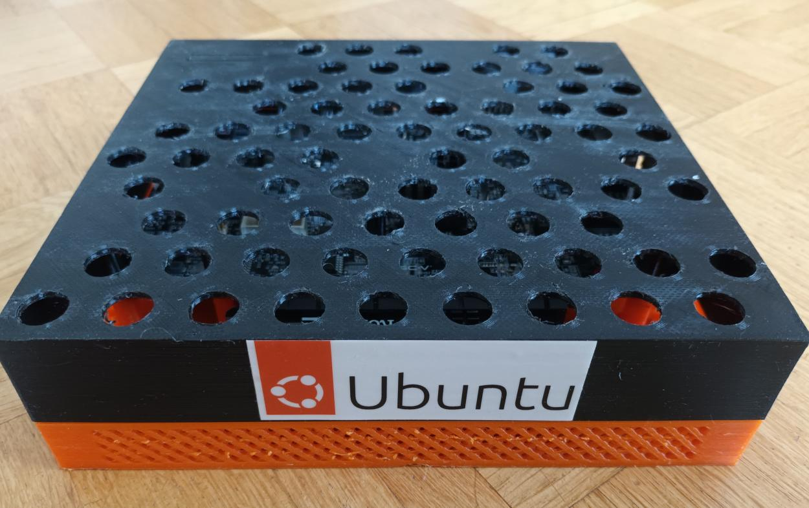
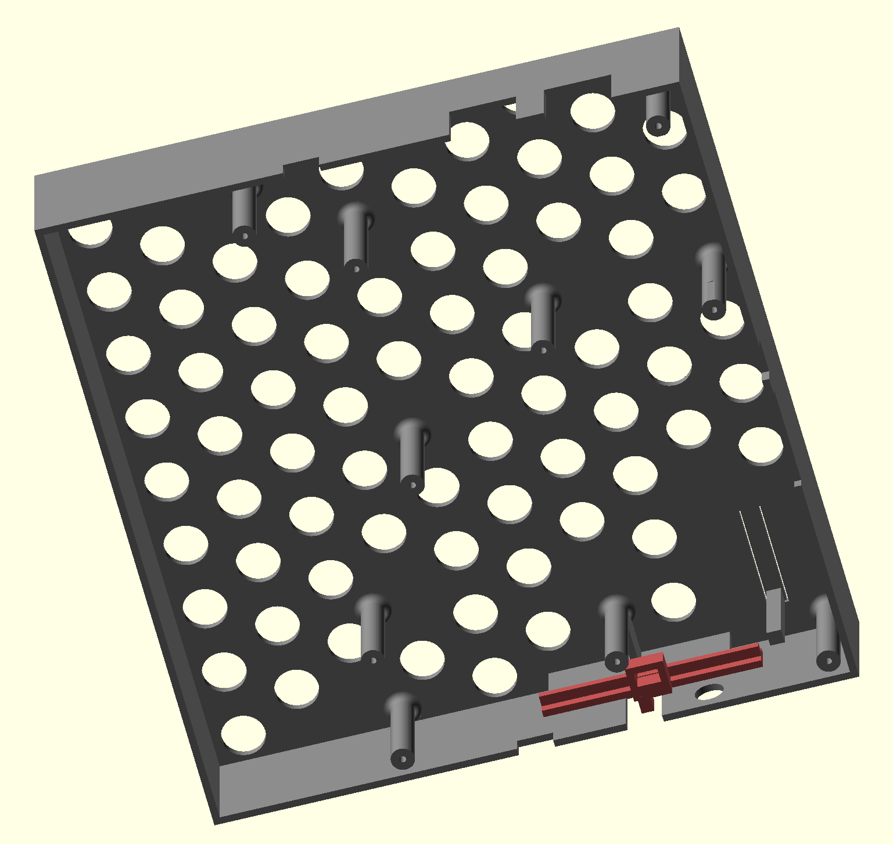

Case for PolarFire Icicle Kit
=============================

The repository contains the OpenSCAD file and the STL files for the case in
the images below.

You will need an M2.5 thread cutter for mounting the board with M2.5x8mm screws.

License
-------

Creative Commons Attribution-ShareAlike 4.0 International Public License
(CC BY-SA 4.0)

Details see https://creativecommons.org/licenses/by-sa/4.0/
